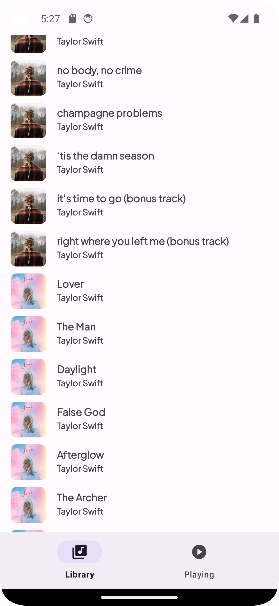

#  Music Player

### [Download Here](https://github.com/adepge/music-player/releases/tag/Release)

### Introduction
I have made a simple music player app that lists the audio files on your phone and enables you to play them with several media control features. To use the app, launch the application and provide the necessary storage permissions. This app is compatible with **Android 9.0+** and above.

Note:  You will need to get audio files on your device / AVD in order to test this functionality (if you have an issues look at the common solutions section below).

 
 

Shown above are the two main views on the app (Library and Playing) in Android 9. I used the Pixel 3a running API 28 for these images.

### Design Rationale

#### Main Activity
I decided to use one main activity with a bottom navigation view to make it easy to navigate between the Library and Playing Fragments. The main activity also contains all the runtime permission requests needed for the application to work. 

#### Fragments

- **Library Fragment** - I decided to use a LinearLayout for the RecyclerView with a song ViewHolder with an ImageView and TextView to display the song album art, song title and artist. This results in an easy to view, clean layout of songs in the library Fragment. In addition, each song ViewHolder has an OnClickListener to play the selected song on press.

-  **Playing Fragment** - I used a ConstraintLayout to position all the elements of the view, including the media buttons and seekbar (in addition to the song information). The media buttons use the ImageButton class (under Android widgets). The PlayingFragment also has a Runnable instance to update the seekbar while a song is playing

#### Data Storage Decisions

- **MediaStore API** - Due to scoped storage restrictions after Android 10+, I decided to use only the MediaStore API to query the song URIs and corresponding properties (art, title, artist) as well as the media file URI in order to access the audio file for playback.

- **SharedPreferences** - I used SharedPreferences to save the state of a currently playing song which persists upon application out of view or exit. When there is a change to the song playback (pause/stop) the app will save the currently playing song and its current position, and restores this upon reopening the application again. 

#### Services and Helper Classes

- **MediaNotificationManager** - When playing a song, a media playback notification will be set up as well as the corresponding media buttons for controlling the song. The notification runs as a foreground service.

- **MediaPlaybackService** - This service manages the loading and playback of songs. It sets up the media session and player to play the audio files as well as handling all media control Intents (from Notification, PlayingFragment, or peripheral media buttons). This service handles the required callbacks as well as the next/previous song behaviour.  

Media Notification shown in Android 9

### Challenges and Future Improvements

#### Resolving version compatibility

This was the most difficult and time-consuming process of the application development. The only rationale for using Android 9.0+ was the introduction of sound enhancements and compatibility with most Android devices. However, I had difficulty in making all features compatible with each Android version, such as the metadata requirement for media playback notification after Android 11. I have tested individually each version of Android from 9 to 14 using the AVD in Android Studio.

#### Loading and running services

This was a less tedious process, but still was one of the more difficult issues to resolve. Errors such as continuous skipping, non-loading album images, non-responsive media actions which were all involved with running the MediaPlaybackService were more difficult to resolve due to not understanding the MediaPlayerCompat behaviour and knowing which listeners it targets. 

#### Future Improvements

There are plenty of improvements that can be made to this app, as it is rather bare-bones. Common music player features such as filtering, search, album, artist and playlist views would enhance the app further. Quality of life features such as favorites, volume control and user defined settings would also improve the app. Optimizing the views for larger devices would also improve the look of this app. 

Possibly optimizing for large mobile devices (with larger pixel density) and tablets could be a useful improvement (shown above: Android 14)

### Common Issues and Solutions
- I have no audio files!
    - You can try to install the apk provided at the root directory of the uploaded zip
    - Upload audio files (mp3, flac etc.) through the device explorer in the right sidebar of Android Studio (`/storage/self/primary/Music`)

- My media files are not loading!
    - Check if the storage permission (and notification permission after Android 13) has been granted
    - If you uploaded song files through the **device explorer** of Android Studio, you may need to move the audio files within the AVD's file app to another folder (like Downloads / Music) in order for the device to register the presence of audio files
        - For example, click your audio folder and move to `Music` (even if its in the same directory)
        - Or try and download an audio file from a browser to your device to see if it updates

- The layout looks really weird?
    - Try using a smaller device (between 5.0" - 6.3")

- I have no sound playing at all!
    - Try and turn up the volume of your device and also of the AVD

- Why is my song not playing?
    - Make sure your audio file is a compatible audio file (mp3, flac) and not a non-compatible file (midi etc.)
    - If your device is slow or lower in specification, it may take some time for the mediaPlayer and mediaSession to load before the song starts playing

- No notification showing?
    - If this occurs in Android 10+, there is a possiblity the metadata did not load correctly, you may have to change to Android 9 or 14

- Songs are continuously skipping!
    - This bug should have been resolved, but in case it occurs, quickly switch back to the library view and the skipping should stop
    - If you have only one or two tracks, it may cause the shuffle and repeat functionality to bug, you can try adding extra tracks
